# Nucleo64 Z80 H533

Nucleo64 Z80 H533 is a Z80 expansion board for the STM32 NUCLEO-H533RE that lets you run a real Z80 system with Microsoft BASIC and CP/M.

It combines a physical Z80 CPU, SRAM, and an STM32H533, which handles the I/O side at high speed.
With a microSD card, the board can boot CP/M directly, and it can even access a real USB floppy disk drive experimentally.

If you enjoy retro computers, homebrew hardware, or classic 8-bit systems, this board is a compact way to build and explore a modern Z80 machine.

Compared with the earlier <a href="https://github.com/hanyazou/Nucleo64_Z80">Nucleo64 Z80 project</a>,
this version provides faster I/O handling and adds a USB interface.

## Features

- Simple two-chip Z80 section using a Z80 CPU and SRAM
- Firmware includes Microsoft BASIC and an IPL (Initial Program Loader)
- Higher Z80 clock speed, up to 20 MHz
- microSD card over SPI for use as CP/M floppy disk images
- Experimental support for a real floppy disk drive over USB

This project is derived from satoshiokue's MEZ80RAM and SuperMEZ80-CPM.

## Appearance

The white boards shown in the following pictures are the Nucleo64 Z80 H533.

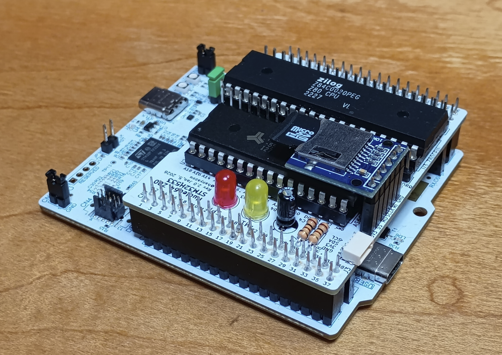

## Block Diagram


For more details, see the <a href="schematic.pdf">schematic (PDF)</a>.

## Required Components


### ICs

- U3 Z80, DIP-40, x1
- U2 AS6C4008-55 SRAM, 4 Mbit, DIP-32, x2

A Z80C0004 (4 MHz) or faster device is recommended.  
If you do not plan to run CP/M 3.0, even 512 Kbit (64 KB) SRAM may be sufficient.   

### Through-Hole Components

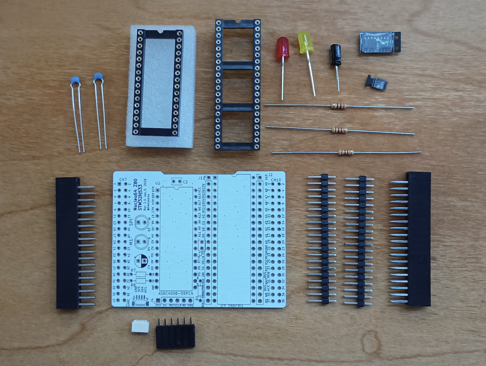

- U3 IC socket, DIP-40
- U2 IC socket, DIP-32
- C2, C3 0.1 uF ceramic capacitors
- C4 10 uF electrolytic capacitor
- R1 200 ohm, 1/6 W resistor
- R7, R8 100 ohm, 1/4 W resistors
- D3, D4 LEDs
- CN7, CN10 2x19 female pin sockets, 0.1 inch pitch

The resistor value for R7 and R8 may need to be adjusted depending on the LEDs you use.

### Surface-Mount Components

- U4 TPS22917DBV load switch, SOT-23-6 *3
- U5 74HCT153D, SOP-16 *4
- C1, C5 0.1 uF capacitors, 0603
- R2, R3 10 k ohm resistors, 0603

*3) This load switch turns the Z80-side power on and off from the STM32H533.  
It helps prevent 5 V from feeding back into the STM32 I/O pins and potentially damaging the MCU.  
The board may still work if 5 V and VCC are tied directly together, but that carries some risk to the STM32 and is not recommended.

*4) This logic IC is used for bank switching.  
If you do not need CP/M 3.0 support, you can omit U5 and short JP1 and JP2 instead.

### Optional Components

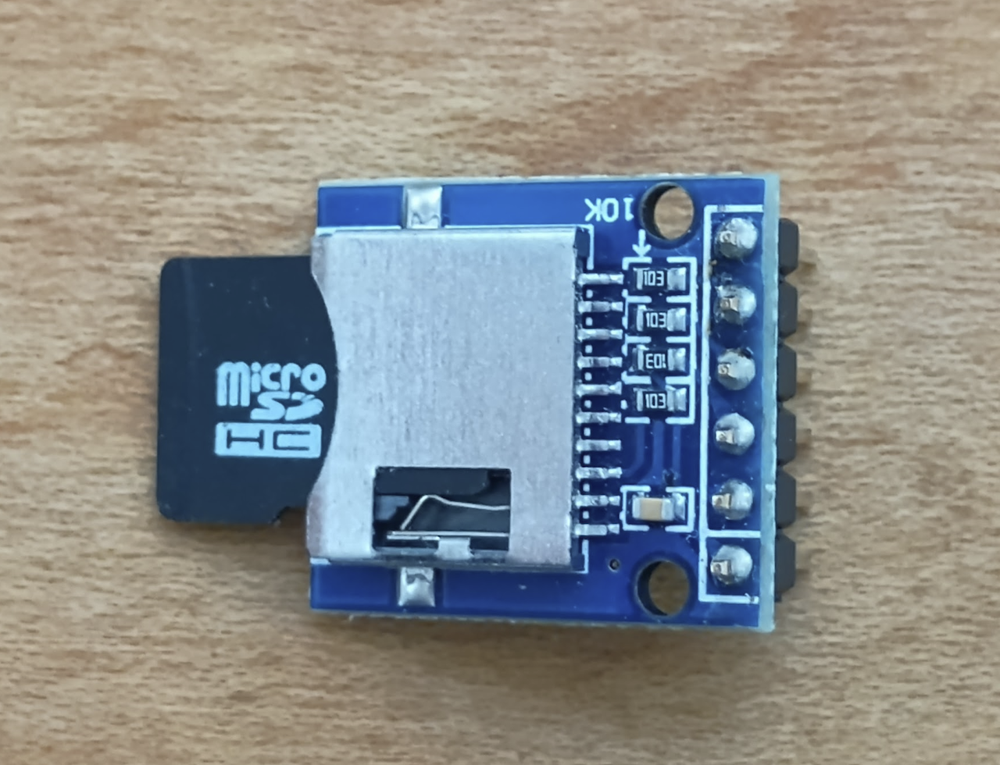

- J1, J2 1x20 pin headers, 0.1 inch pitch
- J3 JST SH 1.0 mm 4-pin connector
- J4 1x6 female pin socket, 0.1 inch pitch

J4 is for I2C Qwiic devices.  
For the microSD card slot, use the ARM/Arduino-compatible type shown on the following page:  
https://www.amazon.com/dp/B0B7WZQVHS

## Assembly Notes

With the small number of parts, assembly is straightforward.
Solder all components except the 2x19 pin headers first, then solder the pin headers last.

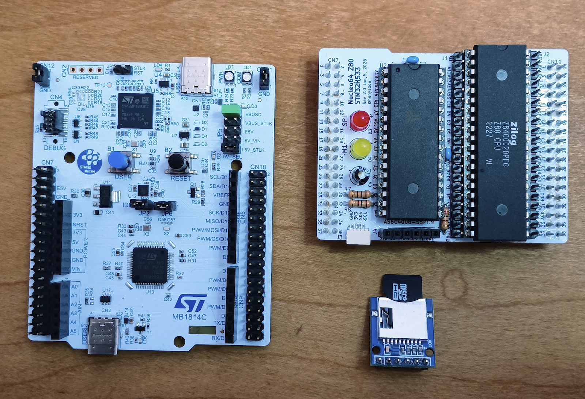

The 74HCT153 and TPS22917 parts I used had markings that made pin 1 orientation hard to identify.
The following photos show the orientation I used during assembly.

<p align="center">
  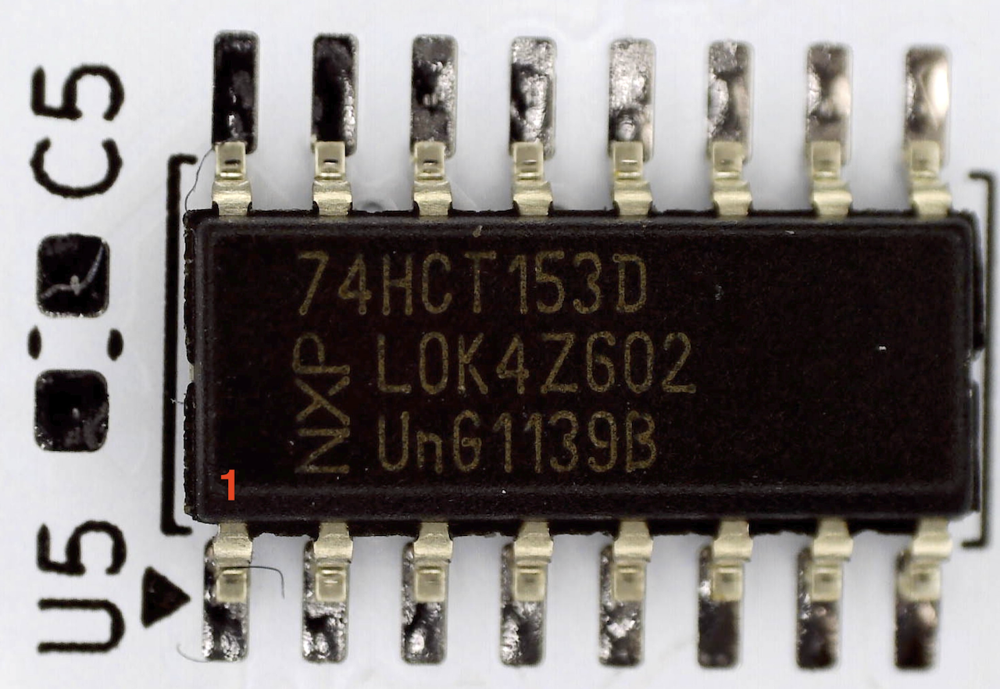
  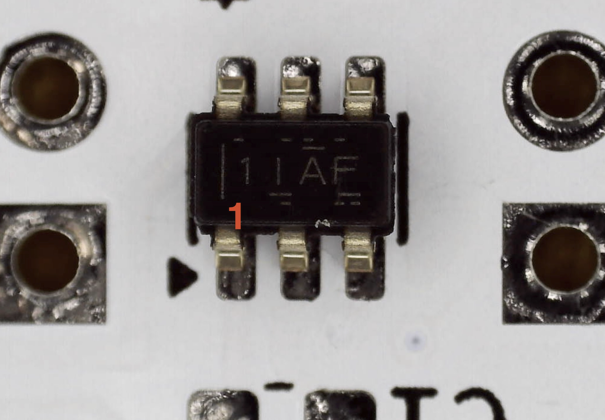
</p>

## NUCLEO Board Modification

ST occasionally revises Nucleo boards, and the hardware details can change slightly between revisions.
The board used here is marked:

`NUCLEO-H533RE NUH533RE$KR2 MB1814-H533RE-C02`

At the time of writing, there does not appear to be another NUCLEO-H533 variant.

On MB1814-H533RE-C02, GPIO pins PC14 and PC15 are connected to the OSC32 low-speed clock circuitry and are not routed to the Morpho connectors by default.
This project uses PC14 and PC15, so you need to rework the solder bridges:

- Remove SB30 and SB31
- Bridge SB29 and SB32

<p align="center">
  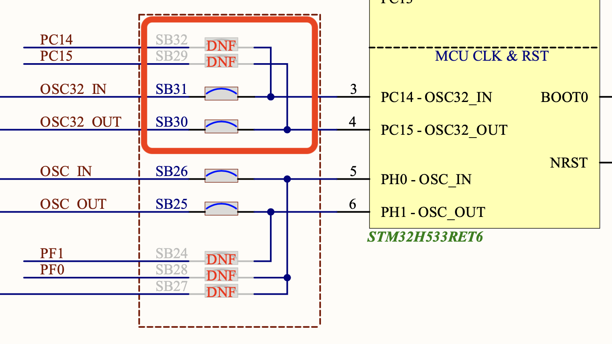
  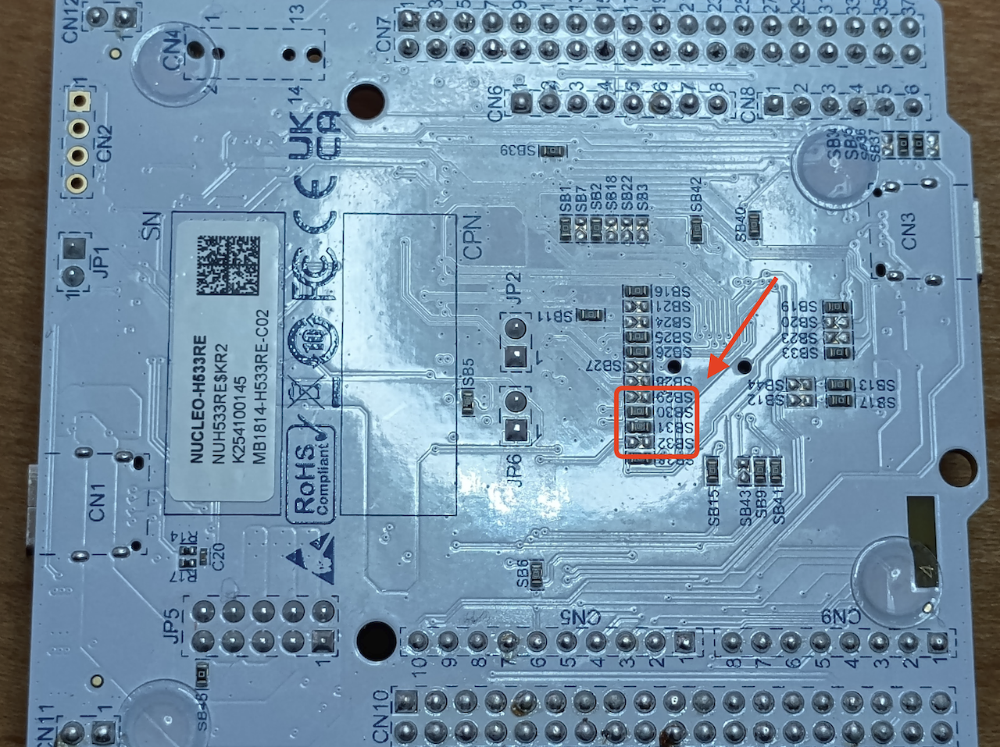
</p>

## Board Firmware

The `FW/projects/h533re` folder contains a STM32 firmware project for STM32CubeIDE.
The current target is the NUCLEO-H533RE.

The firmware includes Microsoft BASIC and an IPL.

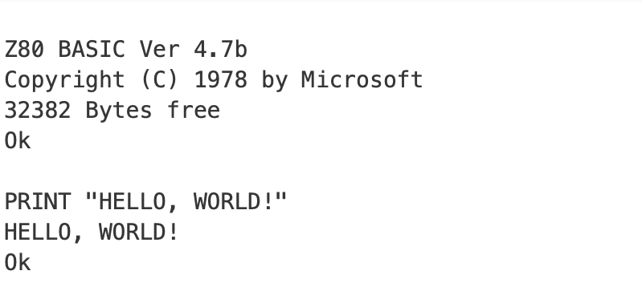

### Change Z80 clock speed

The Z80 clock is generated by TIM2 in the STM32H533.
With a 248 MHz timer clock and a TIM2 counter period of 247, the output clock is 1 MHz, so the Z80 runs at 1 MHz.

If you change the counter period to 12, the Z80 clock becomes about 20 MHz.
In that case, the pulse value should be set to half of the counter period.
At 20 MHz, running `ASCIIARTM.BAS` takes about 60 seconds.

<p align="center">
  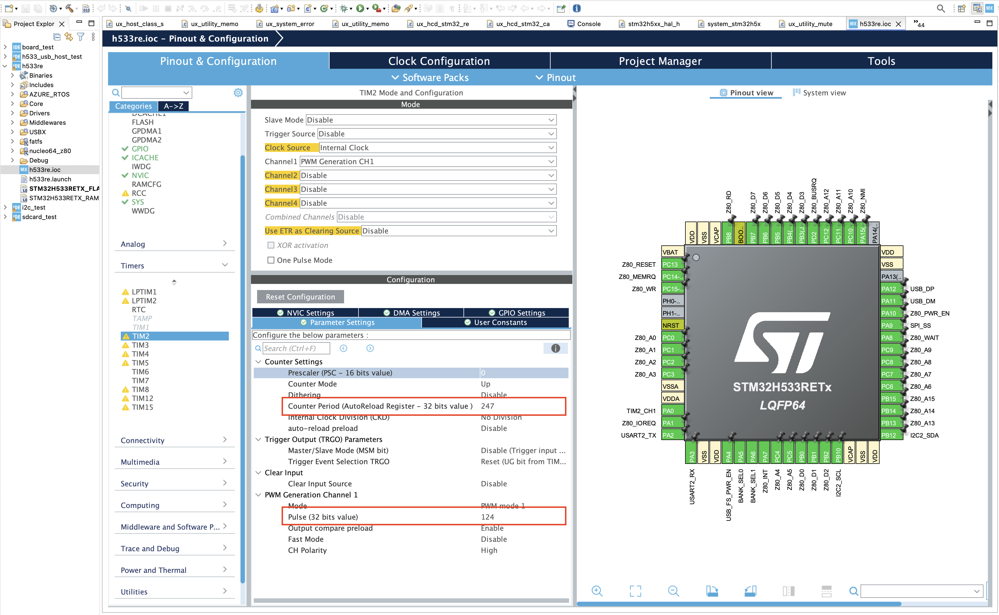
  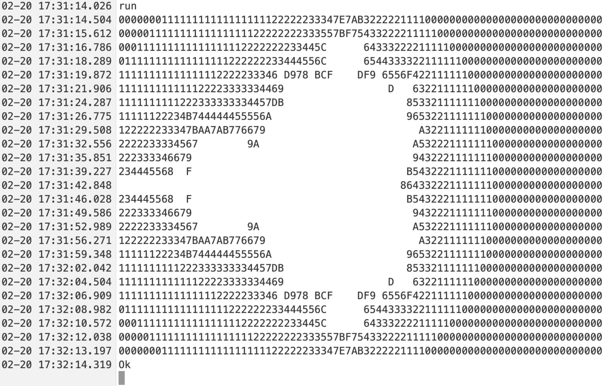
</p>

## Booting CP/M

You can run CP/M on the Z80 by connecting a microSD card slot to the SPI interface, writing a CP/M-80 disk image to the microSD card, and booting the board with that card inserted.

The disk images from <a href="https://github.com/hanyazou/SuperMEZ80">hanyazou/SuperMEZ80</a> can be used as-is.

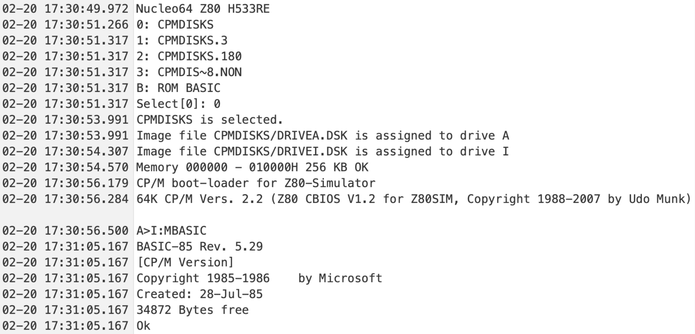

## Connecting a Floppy Disk Drive

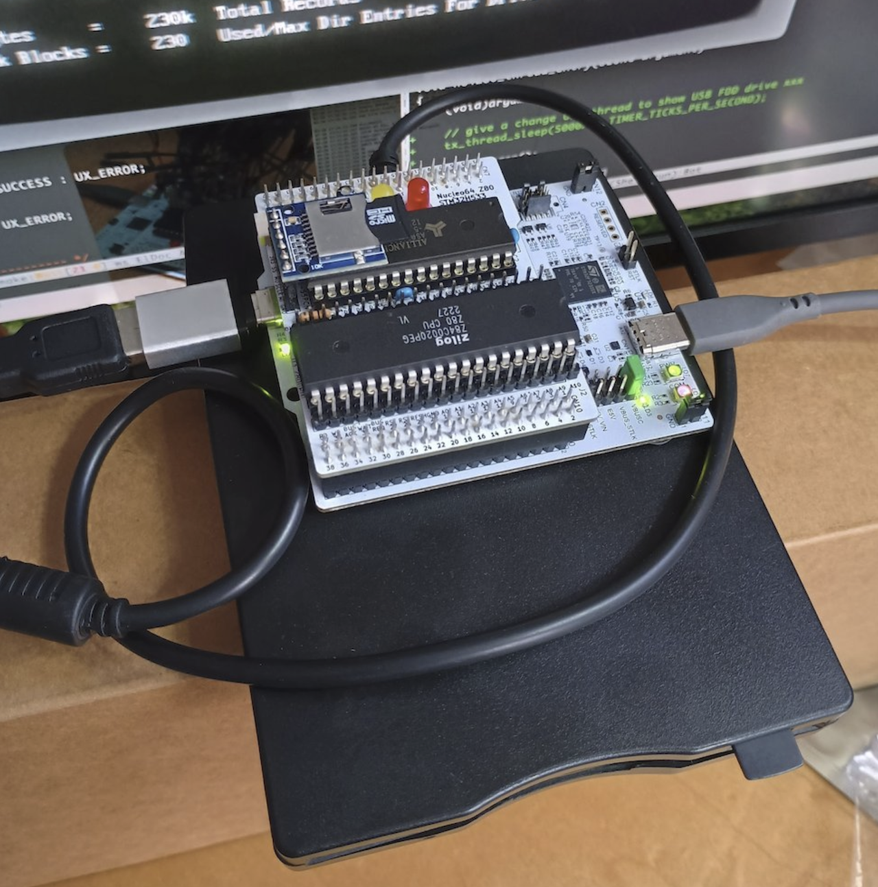

The STM32H533 has USB host capability.
In the photo above, a USB floppy disk drive is connected to the Nucleo board, and CP/M-80 is accessing the floppy disk.

Video: <a href="https://www.youtube.com/watch?v=yQrmxK0HUM0">YouTube</a>

In that video, CP/M boots from the microSD card as drive A:, and then displays the file list on the floppy disk drive assigned as drive C:.
You can also hear the drive access sounds.

The NUCLEO-H533RE board does not explicitly advertise USB host support, but it can operate as a USB host if 5 V is supplied to VBUS at the user USB connector.

The firmware has been tested experimentally with the following USB floppy disk drive, purchased from
<a href="https://amzn.asia/d/04LAehW9">Amazon.co.jp</a>:

- TEAC USB floppy disk drive
- Current support is read-only

```
Device VendorID/ProductID: 0x0644/0x0000 (TEAC Corporation)
Manufacturer String:      1 "TEACV0.0"
Product String:           2 "TEACV0.0"
```

To supply 5 V to VBUS from the USB Type-C connector, short both settings in the NUCLEO power source selection header `JP5`:

- `5V_STLK` to power the STM32 side from the ST-LINK 5 V supply
- `VBUSC` to route power to the user USB connector `CN3`

With both jumpers set, the ST-LINK 5 V supply is fed to `CN3` VBUS.

Be careful here: if you connect `CN3` to a PC or any other device that also drives 5 V onto VBUS in this configuration, you could damage the Nucleo board, the connected device, or both.
Do not connect `CN3` to a host PC while this power configuration is in place.

<p align="center">
  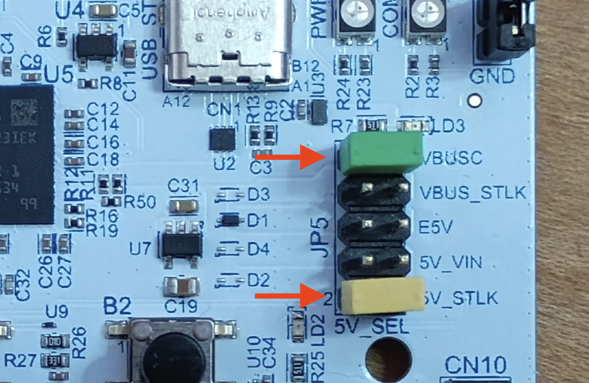
  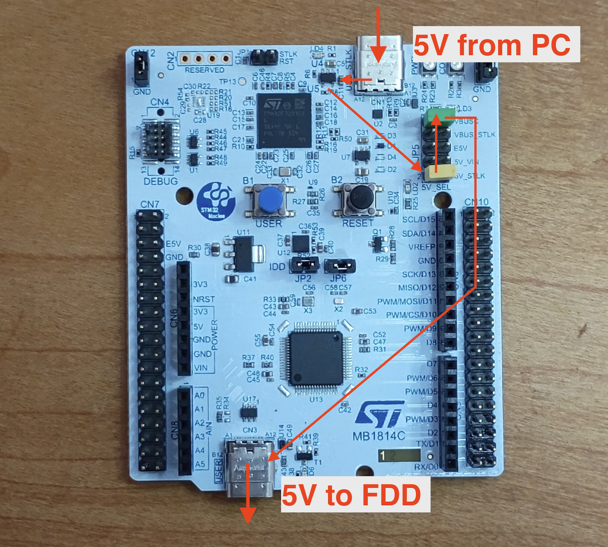
</p>

## References

### SuperMEZ80-CPM

https://github.com/hanyazou/SuperMEZ80-CPM

### EMUZ80

https://vintagechips.wordpress.com/2022/03/05/emuz80_reference/

### MEZ80RAM

https://github.com/satoshiokue/MEZ80RAM

### Nucleo STM32H533RE

#### Board

https://www.st.com/en/evaluation-tools/nucleo-h533re.html

#### Schematic

<a href="https://www.st.com/content/ccc/resource/technical/layouts_and_diagrams/schematic_pack/group2/58/61/64/9a/03/20/4f/84/mb1814-h533re-c02-schematic/files/mb1814-h533re-c02-schematic.pdf/jcr:content/translations/en.mb1814-h533re-c02-schematic.pdf">MB1814</a>

#### User Manual

<a href="https://www.st.com/content/ccc/resource/technical/document/user_manual/group2/86/81/52/e6/5d/f1/46/9e/DM00941891/files/DM00941891.pdf/jcr:content/translations/en.DM00941891.pdf">UM3121</a>
